

# What Is Soular VR?
### A Project Portfolio by Finn H Tanner

  

Soular VR is an creative environment built for Meta Quest 2 that allows players to shape entire worlds with their own hands! The project was inspired by creative sandbox games like <i> Minecraft </i> ,  <i> Spore </i> and <i> the Sims </i> . This page will explore my contribution as a Techincal Developer to the project, formatted in a chronological order and ending with a short reflection. Soular was made as the final project for Goldsmith's MSc XR course. As well as myself, the piece was created by Seonjeong Park (Technical), Ebba Liepe (Art) and Nicalia ThompSon (Art). Soular was built in Unity using Meta's OVR Plugin.

&nbsp;
## Technical Overview

### Player Gestures

My main task for this project was creating a flexible and performant system capable of recording hand gestures as recognisable inputs using Meta's OVR Plugin for Unity. The following code is essentially the final function used for this (although it has been simplified for ease of reading):

  
Show Code

  
  [View full image](https://github.com/aSheedy99/SoularVRProject/blob/edd58203dab4c2b792333ce69a9c67d0a293f9c1/docs/assets/PlayerGestureCarbonSnippet.png)
  

  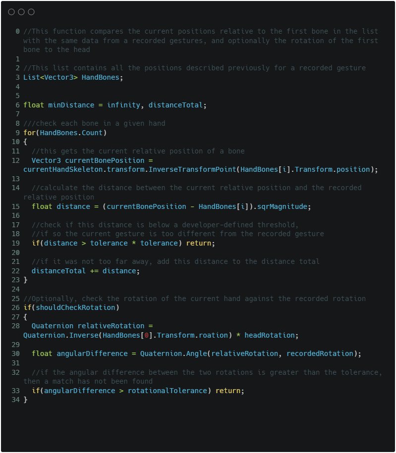

  

&nbsp;
In short,  each OVR hand consists of multiple bones (similar to a rigged model that will be animated). Each bone is a section of the hand, and thus the shape of the hand can be approximated to a good degree by recording their relative distance to some 'reference bones' (in our case, bone 0, the base of the palm). This gives us the shape of the hand - for instance we can tell if the hand is 'pointing'. However, some inputs may need more specific data. For this, I take the relative rotation of the reference bone to the player's head (the OVR camera). With this information, we can not only specify 'the player must be pointing to do X' but 'the playeer must be pointing to their left to do X'.

When comparing the current hand to the recorded gestures, I simply take the distance of each bone's relative position to it's recorded counterpart. If this distance is below a certain threshold, it is considered close enough to be a match. If all bones are below this threshhold, the total distance is recorded. At the end, the lowest recorded total distance is considered the current gesture. A similar process happens for rotation, however here the Quaternion rotations are converted to angles for ease of comparison to a threshold float.

&nbsp;
### Saving

  

A major feature we wanted to include in Soular was the ability for players to save and reload planets at a later time. I explored many methods of saving in Unity, and settled on Binary Formatting. I found this to be the most adaptable method with the only slight snag being any saved data had to be made of specific basic data types, which required at-runtime conversion of things into arrays of floats or integers. Below is an example of a serializable  Colour class (or sColour for short):

  
Show Code

  
  [View full image](https://github.com/aSheedy99/SoularVRProject/blob/09d053874c6e17e8331b903e65ebb34111ff7c78/docs/assets/SaveableColourCarbonSnippet.png)
  

  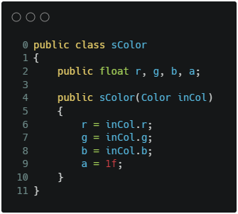

  

&nbsp;
The more complex part of this was telling the save data what object was being saved, since Game Objects weren't  something that could be formatted into binary. To solve this, each model is given an ID integer which correlates to a 'master list' of all models. When it comes to saving, only this integer, a position, rotation and colour are saved for each placed model. When the planet is loaded, the list is looped through, instantiating an instance of a prefab from the master list at the index specified, at the position and rotation specified etc. This increases the workload for creating models slightly, since they have to be added to the master list and given the appropriate ID, but makes it very quick and easy to save and load.

&nbsp;
### Painting

  

A main feature of Soular is the ability to paint the planet surface in different colours. For this, I created a vertex-colour shader that works with a 'paint brush' the player can use. When the brush collides with the planet, the colour of the vertices of the nearest chunk are changed to the chosen colour. We used a chunk system to limit how many vertices were check through to improve performance, since each one had a square distance check. The code below is a foreach loop that demonstrates a simplified version of how this works.

  
Show Code

  
  [View full image](https://github.com/aSheedy99/SoularVRProject/blob/edd58203dab4c2b792333ce69a9c67d0a293f9c1/docs/assets/VertexColourCarbonSnippet.png)
  

  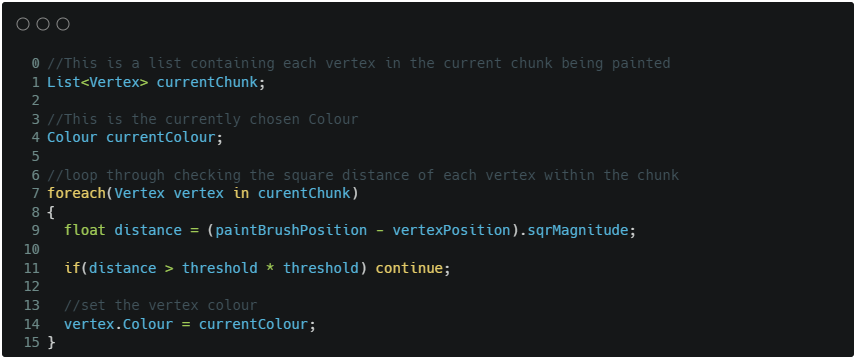

  

&nbsp;
### Menu and UI

Whilst the artist side of the UI fell to other team members, it was my role to develop much of the functional side of the physical UI. I handled interactions by spawning sphere triggers on the finger tips of each hand, allowing me to easy detecting collisions with buttons. It was then a case of creating scripts that handled things like tab systems for swapping active model groups, or swapping and applying the chosen planetary ring.

  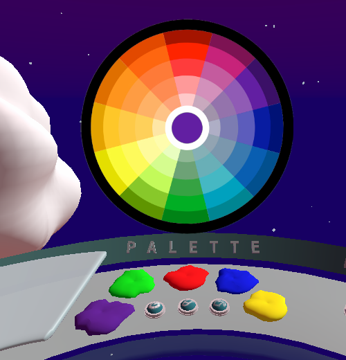

I also created the system for choosing colours from a 'Colour Ring'. The colour ring uses a source image and the colour is set when the player taps the colour they want. The pixel where the user touches the colour ring is then sampled and the colour of that pixel is set as the custom colour. The below snippet is the function used for this:

  
Show Code

  
  [View full image](https://github.com/aSheedy99/SoularVRProject/blob/332185426d9b1380365766179db5fab90ce652e0/docs/assets/GetColourCarbonSnippet.png)
  

  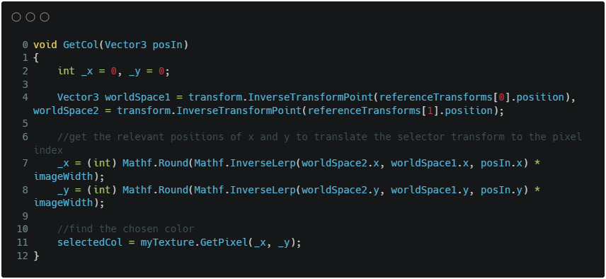

  

&nbsp;
### Ocean Shader Graph

|   |   |
|---|---|
| |  | 

A large part of any earth-like plant is the ocean (approx. 70% I believe!) and as such, we wanted the player to be able to create good looking oceans, lakes and rivers easily. Behind the scenes, this is simple a sphere with a custom shader that can be shrunk or expanded to raise and lower water level. Howvever, to give the player that extra 'alien world' field, we didn't want to restrict them to just earth-like blue oceans. To this effect, I created a shader that could be fed a colour and programatically choose a darker shade (for the ocean deapths) and a lighter shade (for the surf foam). as well as having a cartoonish shoreline animation to breathe some life into the planet.

  
Show Shader Graph

  
  [View full image](https://github.com/aSheedy99/SoularVRProject/blob/31a496e739868caa1bbc8f4d7d175790407973cc/docs/assets/MainWaterShader.png)
  

  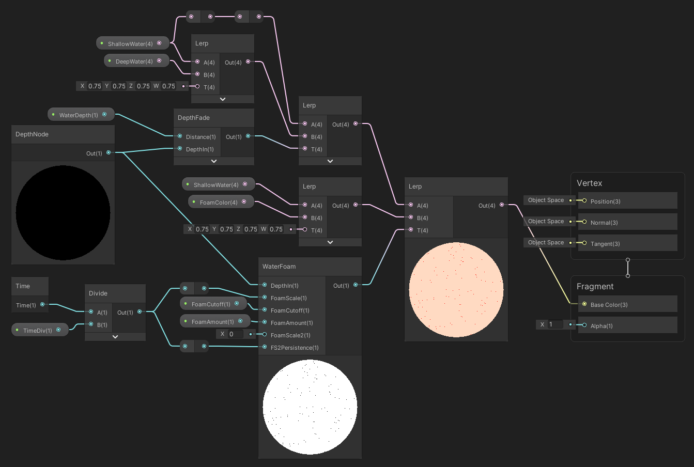

  
  

    
Show Depth Sub Graph

  [View full image](https://github.com/aSheedy99/SoularVRProject/blob/31a496e739868caa1bbc8f4d7d175790407973cc/docs/assets/depthNode.png)

  

    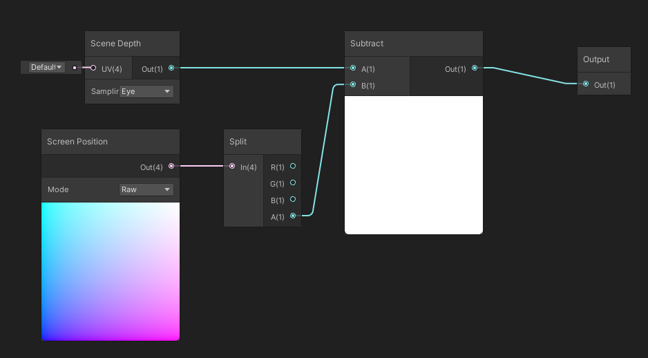
  

  

  
  

    
Show Foam Sub Graph

  [View full image](https://github.com/aSheedy99/SoularVRProject/blob/31a496e739868caa1bbc8f4d7d175790407973cc/docs/assets/FoamSubgraph.png)

  

    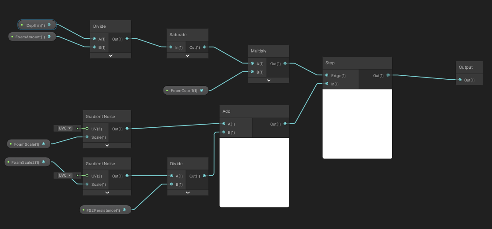
  

  

  

&nbsp;
### Additional Feature

After completing the initial project, we were asked to add an additional feature to the project. I split this into two pieces since my primary additional would not be very obvious or visible.

#### Input Debouncing

Input debouncing is a feature every gaming controller comes with by default. Essentially, it is a way to 'smooth out' input signals, since buttons can often be 'noisy' especially when pressed and released, causing ghost inputs that could completely ruin a player's experience. However, this is not something that is natively included in my Gesture Recognition System and since it's very easy for small adjustments of the hands to cause input ghosting, I decided this should be my major addition to the project. This would serve to make interaction more enjoyable and accurate for players.

I accomplished this by introducing a 'input buffer' that cycles for a defined amount of frames. Rather than directly setting the recognised input, a recognised gesture will instead be added to this buffer. After the specified amount of frames have passed, the most common gesture within the buffer would be set as the current gesture. I found five frames to be a good amount for this that balanced good debouncing with little noticeable latency of input. The below snippet is the core element of this buffer that uses a dictionary to track how many times each input was detecting over the debounce period.

  
Show Code

  
  [View full image](https://github.com/aSheedy99/SoularVRProject/blob/a017f4cc5bc132e6824a6c23aa9d0ffbc3394620/docs/assets/DebounceDictionaryCarbonSnippet.png)
  

  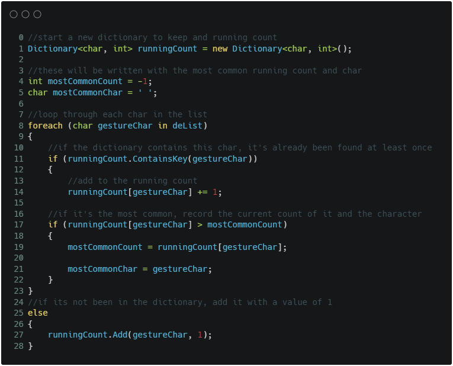

  

&nbsp;
#### Accessibility Labels

My secondary addition was a small adjustment made with the idea of making the suite more accessible. Whilst I love the work the design team did on the icons, I couldn't help but think some people may have difficulties understanding the functions of some buttons. As such, I added a toggle that displays labels describing what each and every button does, in a clean sans-serif font for maximum readability. In the future, I would love to expand this to include audio description based on player gaze, but unfortunately did not have time to include that. Below is a comparison of the menu with and without labels.

  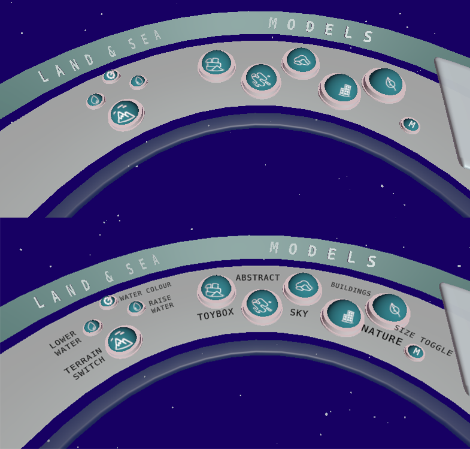

&nbsp;
## User Journey

With the aim of being a creative sandbox for players to experience as they wish, with no guiding narrative or strict flow of content, the user journey of Soular is fairly open. That being said, there is still a general user journey we had in mind when designing Soular that most users will likely follow:

  
Show Journey

  
  [View full image](https://github.com/aSheedy99/SoularVRProject/blob/91d393ff3e7897412c77b7cd7f7b38d2e52cd454/docs/assets/UserJourney.png)
  

  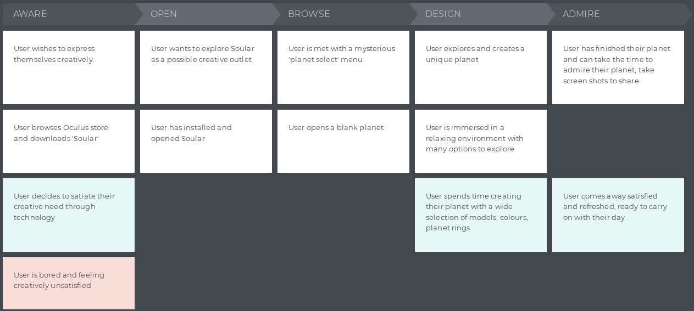

  

&nbsp;
## Walkthrough Video

<iframe align="center" width="560" height="315" src="https://www.youtube.com/embed/Bnriz6gGjxM" title="YouTube video player" frameborder="0" allow="accelerometer; autoplay; clipboard-write; encrypted-media; gyroscope; picture-in-picture" allowfullscreen></iframe>

&nbsp;
## Reflection

Overall, I am extremely proud of the final product myself and the team created. I believe we exceeded the goals we set for ourselves and made something genuinely fun, creative and innovative. However, there are still some key areas I would change looking back. Firstly, I would not use hand tracking were I to start from scratch. Whilst it is an incredible tool, and one I think is the future of VR, the Quest 2's hand tracking capabilities are simply subpar. Lighting can play havoc on the accuracy of tracking, with older British lights (like those in my apartment) apparently operating at a frequency that interferes with the cameras used for tracking.

I originally wanted to used hand tracking for this project to create a more unique and equal experience for players, but when something as uncontrollable as the wiring in your house can have such an adverse effect on your experience, this becomes somewhat of a moot point. Perhaps this will be worth revisiting when LIDAR hand tracking becomes more widely available, since that does not require visible light.

Whilst I was not in charge of the planet generation and terrain manipulation, I think changing from a chunk-based mesh to a marching cubes system would also greatly improve the experience, allowing players to make more interesting shapes and formations, including caves and overhangs, which are not possible in the current system.

Finally, one feature I would love to include in the future would be shareability of planets, with players being able to send their creations to one another. Perhaps even this could become some kind of multi-player experience, where players can create planets in the same virtual space together, regardless of physical location.

Looking at what I was able to include, I would say the most challenging part was the hand tracking system, and integrating it with areas other people worked on, like terrain manipulation. I think there is still a long way to go on optimising the code, even over the duration of the project I learnt many things that highlighted pitfalls in previous parts of the system that unfortunately we didn't have the time to 'de-weed'. The next iteration of this system will no doubt be far more performant and user friendly to boot, and I plan on making a free Unity Asset publicly available so others can use and expand my work in this area.
